# Deploying a Static Website on AWS EC2 with Nginx on Amazon Linux
## Introduction
This project shows how to deploy a static website on an Amazon Linux EC2 instance using the Nginx web server. It covers setting up the server, configuring Nginx, and making the site publicly accessible through the EC2 instance’s IP. The process helps understand basic server management, hosting concepts, and how cloud platforms like AWS make website deployment simple and scalable.


---

## Features
- Host a static website using AWS EC2 with Amazon Linux.

- Configure and serve content using the Nginx web server.

- Access the website via a public IP address.

- Scalable and cost-effective cloud hosting solution.

- Lightweight and fast deployment suitable for beginners and professionals.
---

## Prerequisites
- AWS Account with access to launch EC2 instances.
- Basic understanding of Linux commands and server setup.
- An SSH key pair to securely connect to the EC2 instance.
- Opened required ports (HTTP – 80, SSH – 22 ) in the security group.
- The static website files (HTML, CSS, JavaScript, and assets)
---
## Steps to Deploy Static Website

### Step 1: Steps to Prepare Static Website Files
- Download a static website template.


- Extract the downloaded files.

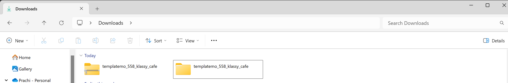

- Move the extracted folder to the directory where your SSH key (.pem). (Rename the folder if the name  complicated to simplify navigation.)

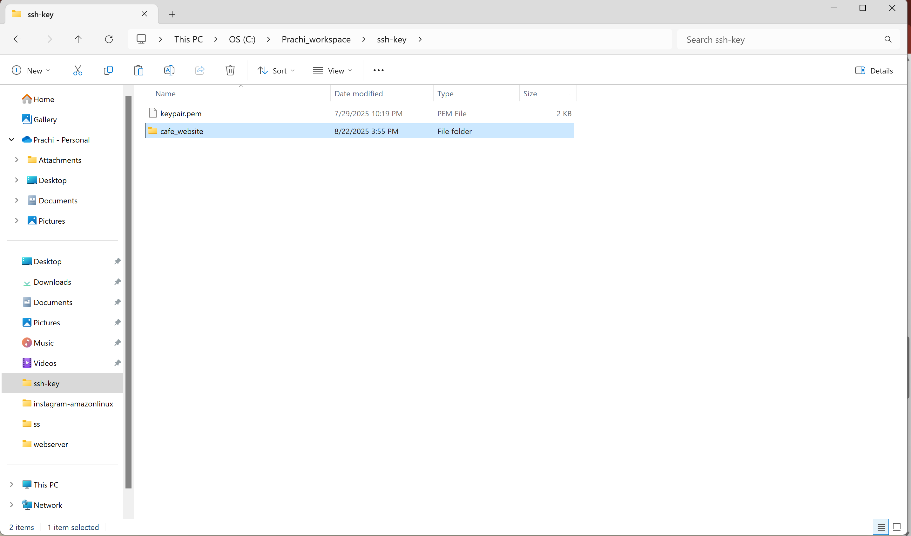

### Step 2: Login into AWS Account and Launch Ec2 Instance

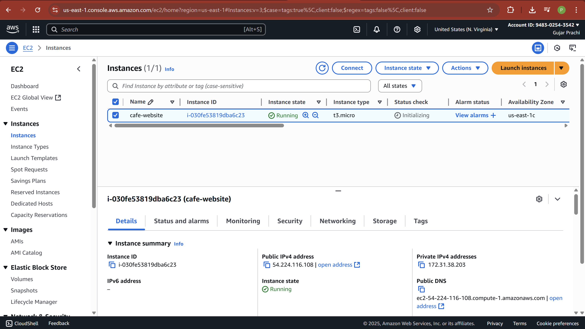

### Step 3: Copy the static website files from local machine to the EC2 server using SCP
```bash
# to copy files from local machine to ec2 server 
scp -i "private key" -r website_name/ ec2-user@public_ip:/home/ec2-user/
```
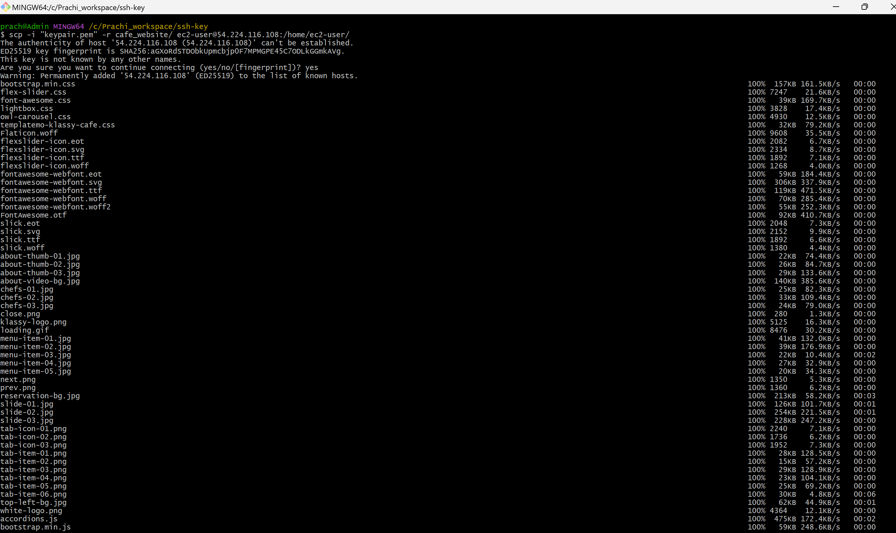

### Step 4: Establish a secure connection to the EC2 instance using an SSH client.

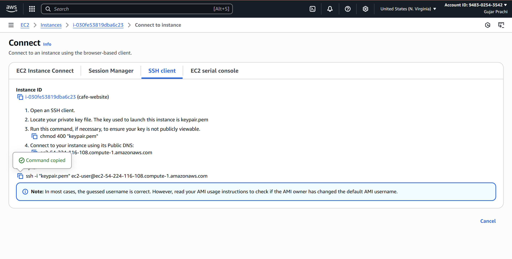
- Copy the SSH command provided in the EC2 console and paste it into Git Bash to connect to your instance.

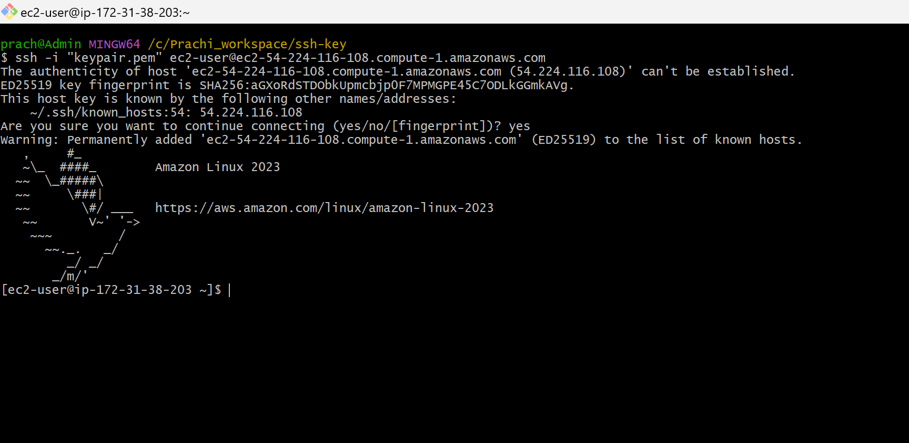

### Step 5: Update the system packages on the EC2 instance using the update command.
```bash
# to update
sudo yum update 
```
```bash
# to verify whether the copied folder is present in the current directory.
ls
```
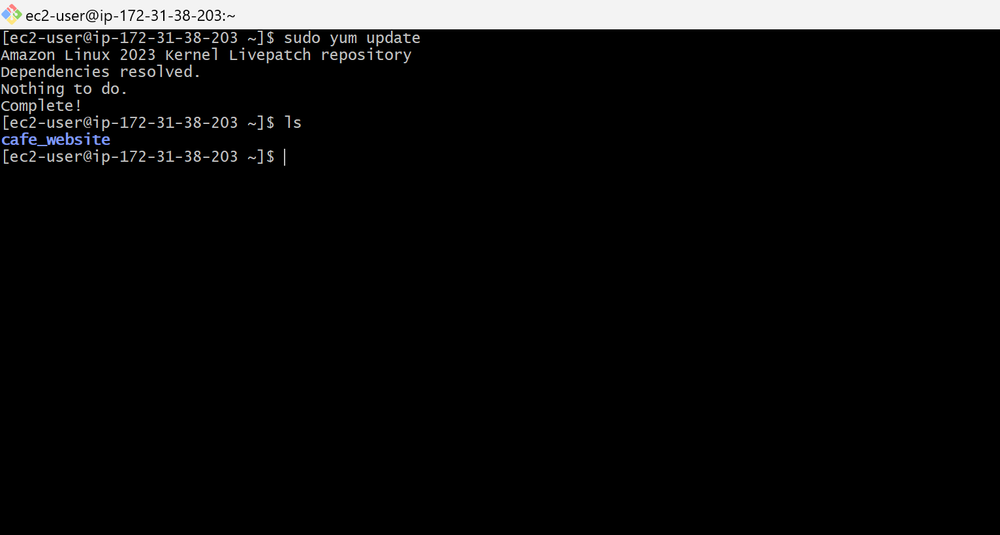

### Step 6: Install the Nginx web server on the EC2 instance.
```bash
# to install nginx webserver
sudo yum install nginx -y 
```

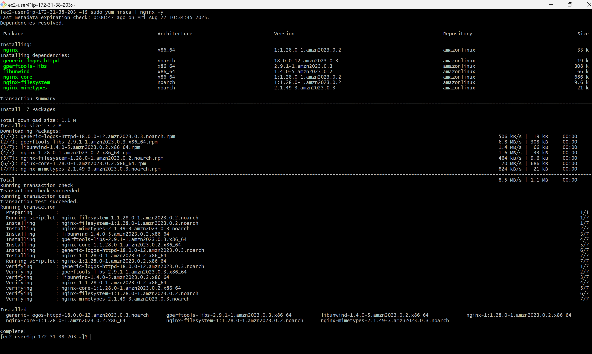

### Step 7: Start Nginx, enable it to run on boot, and verify its status.
```bash
# to start nginx
sudo systemctl start nginx
```
```bash 
# to enable 
sudo systemctl enable nginx
```
```bash
# to verify status
sudo systemctl status nginx
```

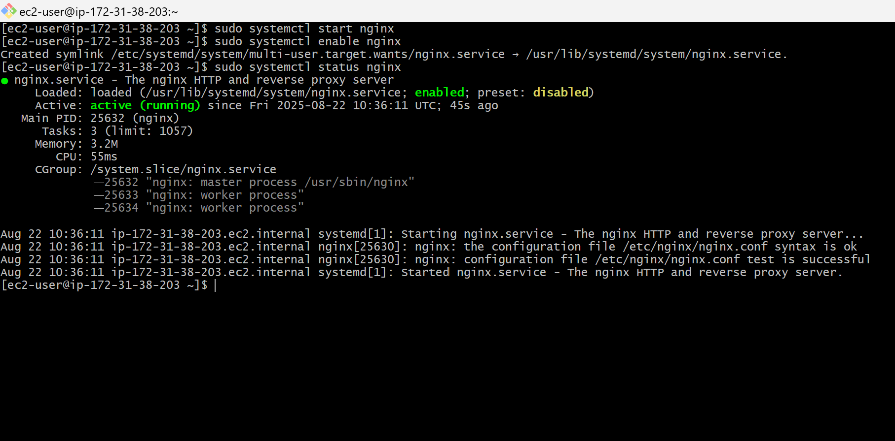

### Step 8: Copy the website folder from the EC2 user directory to the Nginx web server directory. 
```bash
# to copy folder from server to webserver
sudo cp -r website_name/* /usr/share/nginx/html/
```
```bash
# navigate to default path and use ls to verify that all files have been copied.
cd /usr/share/nginx/html/
```
```bash
ls
```
```bash
#to restart the Nginx web server to verify the applied changes 
sudo systemctl restart nginx
```

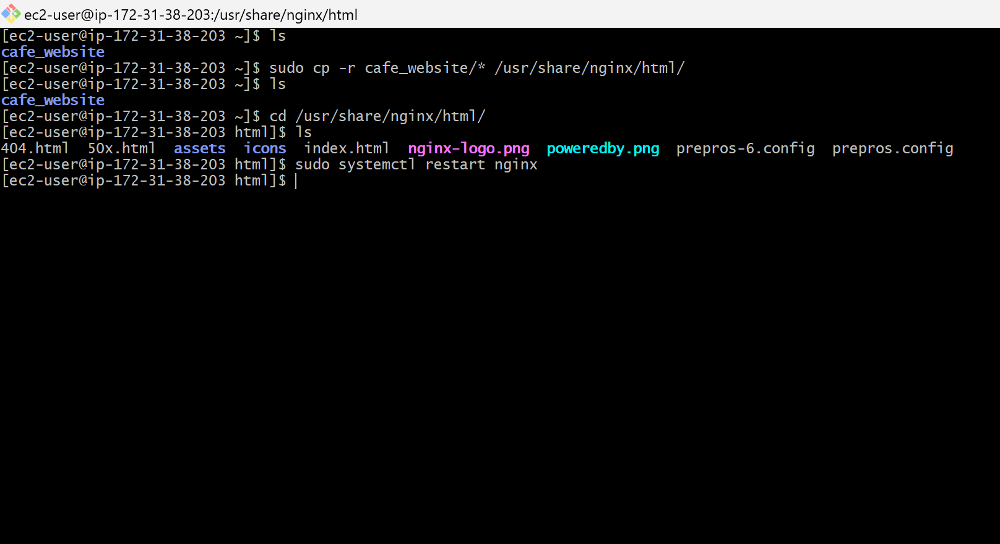

### Step 9: Copy the EC2 instance’s public IP address from the AWS console.

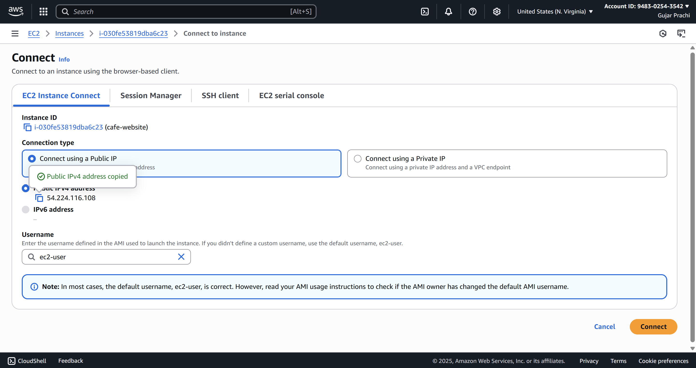

### Step 10: Paste the public IP address into a web browser to view the deployed website.


---
## Summary
This project demonstrates the deployment of a static website on an Amazon Linux EC2 instance using the Nginx web server. The steps include downloading and preparing website files, transferring them to the EC2 server, connecting via SSH, installing and configuring Nginx, copying the files to the web server directory, and finally accessing the website using the instance’s public IP address in a browser.

